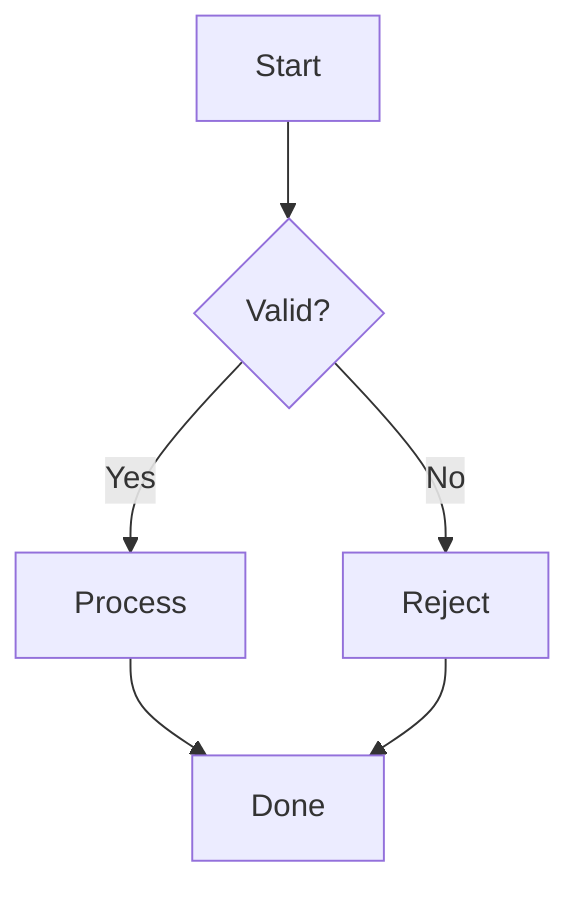

# mermaid2ascii

Render [Mermaid](https://mermaid.js.org/) diagrams as plain ASCII/Unicode text for terminals and coding agents.

Currently supports **flowcharts**.



Renders as:

```text
             ┌───────┐
             │ Start │
             └───────┘
                 │
                 v
        /────────────────\
        |     Valid?      |
        \────────────────/
                 │
           Yes   │   No
        ┌────────┴─────────┐
        │                  │
        v                  v
┌──────────────┐   ┌──────────────┐
│   Process    │   │    Reject    │
└──────────────┘   └──────────────┘
        │                  │
        └────────┬─────────┘
                 │
                 v
             ┌──────┐
             │ Done │
             └──────┘
```

## Install

### Claude Code — one command

Install the skill directly from GitHub:

```bash
curl -fsSL https://raw.githubusercontent.com/darshDM/mermaid2ascii/main/install.sh | bash
```

The installer sets up everything automatically:

* Installs the skill to `~/.claude/skills/mermaid-ascii`
* Creates an isolated Python environment inside the skill
* Installs the Mermaid → ASCII renderer
* Exposes the `mermaid-ascii` command through `~/.local/bin`
* Requires no global Python packages
* Requires no manual `.claude` setup

Restart Claude Code after installation.

### Manual installation

If you prefer not to use the installer:

```bash
git clone https://github.com/darshDM/mermaid2ascii.git ~/.claude/skills/mermaid-ascii
```

Then install the Python package:

```bash
cd ~/.claude/skills/mermaid-ascii
python3 -m venv .venv
.venv/bin/pip install .
```

## Usage

### With Claude Code

Once installed, simply ask Claude to create or render a Mermaid flowchart.

For example:

> Create a flowchart showing the authentication flow.

The skill detects the Mermaid diagram and renders it as an ASCII/Unicode diagram directly in the terminal or response.

### CLI

Render a Mermaid file:

```bash
mermaid-ascii diagram.mmd
```

Render Mermaid code directly:

```bash
mermaid-ascii -c "flowchart TD; A[Start] --> B[End]"
```

Or pipe Mermaid through stdin:

```bash
cat diagram.mmd | mermaid-ascii
```

You can also run the module directly:

```bash
python3 -m mermaid_ascii.cli diagram.mmd
```

## Supported diagrams

Currently:

| Diagram          | Status |
| ---------------- | ------ |
| Flowchart        | ✅      |
| Sequence diagram | 🚧     |
| Class diagram    | 🚧     |
| State diagram    | 🚧     |
| ER diagram       | 🚧     |

More diagram types will be added over time.

## Flowchart support

| Feature                                                       | Status      |
| ------------------------------------------------------------- | ----------- |
| Rectangle, rounded, stadium, circle, decision, hexagon shapes | ✅           |
| Solid, dotted, thick arrows                                   | ✅           |
| Edge labels                                                   | ✅           |
| Cycles & skip edges                                           | ✅           |
| TD, TB, BT, LR, RL directions                                 | ✅           |
| Width fitting                                                 | ✅           |
| Subgraph syntax                                               | ✅ Flattened |
| Automatic routing                                             | ✅           |

## Python API

The renderer can also be used directly from Python:

```python
from mermaid_ascii import convert

diagram = convert("""
flowchart TD
    A[Start] --> B[Process]
    B --> C[Done]
""")

print(diagram)
```

## Architecture

```text
Mermaid source
      │
      ▼
   Detector
      │
      ▼
    Parser
      │
      ▼
 Graph / IR
      │
      ▼
   Renderer
      │
      ▼
 ASCII / Unicode
```

Each diagram type is designed to be independently extensible.

To add a new diagram type:

1. Add a parser in `parsers/`
2. Add a renderer in `renderers/`
3. Register it with the detector/factory
4. Add tests

See `AGENTS.md` for development guidelines.

## Project structure

```text
mermaid2ascii/
├── mermaid_ascii/
│   ├── cli.py
│   ├── detector.py
│   ├── models.py
│   ├── parsers/
│   ├── renderers/
│   └── ...
├── SKILL.md
├── install.sh
├── pyproject.toml
├── README.md
└── LICENSE
```

## Uninstall

Remove the Claude Code skill and CLI:

```bash
rm -rf ~/.claude/skills/mermaid-ascii
rm -f ~/.local/bin/mermaid-ascii
```

## Contributing

Contributions are welcome, especially new Mermaid diagram parsers and renderers.

See `CONTRIBUTING.md` for development instructions.

## License

MIT
